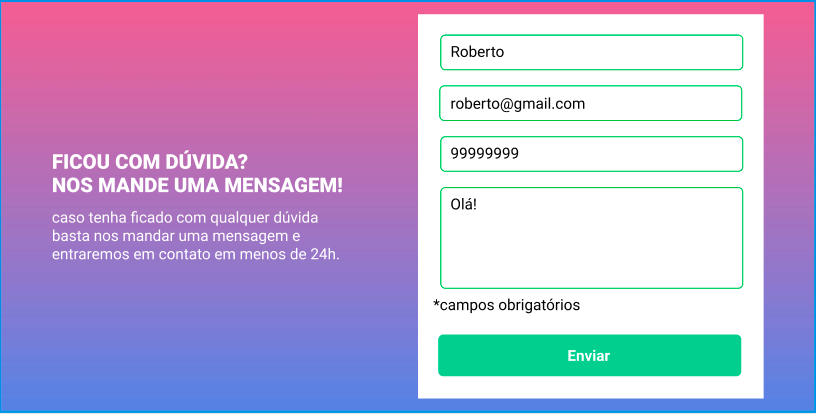

# Desafio do curso < Dev Quest > HTML+CSS+JS (Intermediário).

## utlizando um projeto do figma, criar uma página com formulário, que apresente validação para os conteúdos adicionados em campos obrigatórios.

### Design para página:
 

### Design para não preenchido:

### Design para formulário preenchido:

#### tecnologias usadas:
- HTML
- CSS
- JS

Link para o arquivo do figma <a href="https://www.figma.com/design/zBKnYG9UNdUiIr8ClQTWSG/DESAFIO---HTML%2FCSS%2FJS-INTERMEDI%C3%81RIO?node-id=3-2&p=f&t=J5m514G8lKlWzj2O-0" target="_blank">clique aqui</a>
